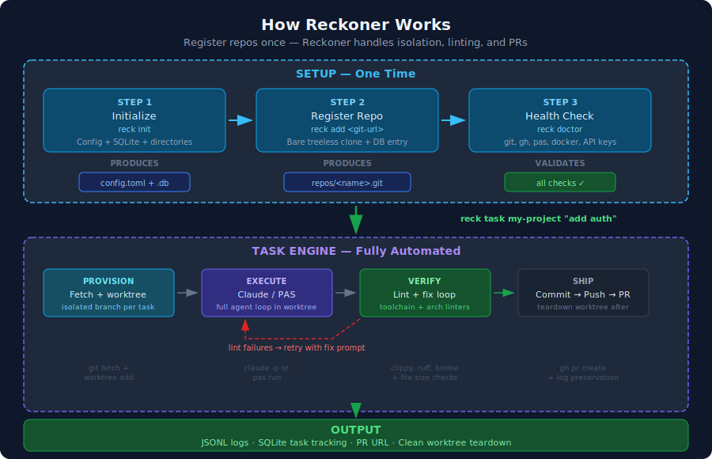
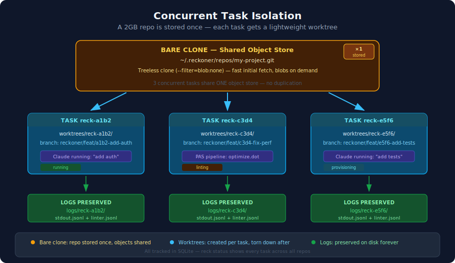

# Reckoner

**One command. Prompt to pull request.**

Reckoner is an AI software factory for your terminal. Point it at any git repo, describe what you want in plain English, and walk away. It fetches the latest code, spins up an isolated worktree, runs Claude (or a [PAS](https://github.com/citadelgrad/pascals-discrete-attractor) pipeline), auto-fixes lint violations, and opens a GitHub PR — all without touching your working directory.

```sh
reck task my-project "add user authentication with JWT tokens"
# → fetches latest code
# → creates isolated worktree on a fresh branch
# → runs Claude Code against the worktree
# → formats, lints, and typechecks the result
# → auto-fixes any violations (up to 3 iterations)
# → commits, pushes, opens a PR
# → tears down the worktree, preserves all logs
# → PR: https://github.com/user/my-project/pull/42
```

**Name origin:** Pascal's mechanical calculator was called "the Reckoner." Reckoner is the machine; [PAS](https://github.com/citadelgrad/pascals-discrete-attractor) is the engine inside it.

## Why Reckoner

### Your repo is stored once, not copied per task

Most AI coding tools check out the full repository for every task. Reckoner stores each repo as a single bare clone and creates lightweight git worktrees — branches that share the same object store. A 2GB repo stays 2GB whether you run 1 task or 20 concurrently. Worktrees are torn down after completion; logs are preserved forever.





### AI writes the code. Reckoner makes sure it's clean.

After Claude generates changes, Reckoner runs your full toolchain — formatter, linter, typechecker — automatically detected per language. When violations are found, it doesn't just report them. It generates a structured remediation prompt and sends Claude back in to fix them. This lint-fix loop runs up to N iterations, with stuck-violation detection that stops early if the same issue persists across rounds instead of looping forever.

Supported toolchains out of the box:

| Language | Format | Lint | Typecheck |
|----------|--------|------|-----------|
| Rust | `cargo fmt` | `cargo clippy` | `cargo check` |
| Python | `ruff format` | `ruff check` | `ty check` |
| TypeScript/JS | `biome format` | `biome check` | — |

Override any of these per-repo with a `.reckoner/toolchain.toml` file.

### Drop-in custom linters

Place any executable in `.reckoner/linters/` (per-repo) or `~/.reckoner/linters/` (global). It receives the worktree path as an argument and outputs JSONL `LintFinding` records. Reckoner discovers and runs it automatically — no configuration, no plugin API. Enforce import boundaries, naming conventions, file organization, or anything else your team cares about.

### Scheduled pipelines that run while you sleep

Set up recurring tasks with a single command. Reckoner generates native macOS launchd agents so your pipelines fire on schedule without a server, a daemon, or Docker running in the background.

```sh
reck schedule add --name nightly-cleanup \
  --repo my-project --pipeline entropy-gc.dot --cron "0 3 * * *"
```

### Every task is auditable

All output is structured JSONL — Claude's responses, toolchain results, lint findings, fix-loop iterations. Each task gets its own log directory that survives worktree teardown. Query logs locally with [`hl`](https://github.com/pamburus/hl) (auto-detected), or spin up the built-in Grafana + Loki stack with one command:

```sh
reck infra up     # Loki + Grafana, ready in seconds
reck observe      # opens the dashboard
```

### No API key juggling

Reckoner invokes the `claude` CLI directly, which authenticates through macOS Keychain. Your existing Claude subscription is all you need — no environment variables, no key rotation, no token management.

## Quick Start

```sh
cargo install --path crates/reckoner-cli

reck init                                          # Create ~/.reckoner/ dirs + config + db
reck add git@github.com:user/my-project.git        # Register a repo (bare treeless clone)
reck task my-project "add user authentication"     # Prompt → PR, fully automated
reck status                                        # Show active tasks
reck logs <task-id>                                # View preserved logs
```

## Commands

| Command | What it does |
|---------|-------------|
| `reck init` | Create `~/.reckoner/` directories, default config, and SQLite database |
| `reck add <git-url>` | Register a repo (bare treeless clone, auto-detects default branch) |
| `reck list` | List all registered repos |
| `reck remove <name>` | Unregister a repo and remove its bare clone |
| `reck sync <name>` | Fetch latest changes from origin |
| `reck task <repo> "<prompt>"` | Full pipeline: fetch, worktree, Claude, lint, fix-loop, PR, cleanup |
| `reck task <repo> "<prompt>" --pipeline <file.dot>` | Use a PAS pipeline instead of direct Claude |
| `reck task <repo> "<prompt>" --no-pr` | Run without creating a PR (useful for analysis tasks) |
| `reck lint <repo>` | Standalone toolchain + architectural lint run |
| `reck status` | All active tasks in a table |
| `reck status <task-id>` | Detailed view: branch, PR URL, cost, errors |
| `reck logs <task-id>` | Summary of all log files for a task |
| `reck logs <task-id> --app` | View Claude's stdout output |
| `reck logs <task-id> --lint` | View lint findings |
| `reck logs <task-id> --filter <str>` | Filter log lines by keyword |
| `reck doctor` | Health checks: git, gh, pas, Docker, API keys, database |
| `reck config` | Show current configuration |
| `reck schedule add/list/remove/run` | Manage background pipelines (macOS launchd) |
| `reck infra up/down/status` | Manage observability stack (Loki + Grafana) |
| `reck observe` | Open Grafana dashboard in browser |

All commands support `reck --verbose <command>` for debug-level tracing output.

## How It Works

A `reck task` moves through a state machine with full audit trail:

```
pending → provisioning → running → linting → pr_open → done
                                      ↓
                                   (fix loop: up to N iterations)
                                      ↓
                                    failed (if unrecoverable)
```

Every state transition is recorded in the database with a timestamp and detail message, so you can reconstruct exactly what happened and when.

**Branch naming:** `reckoner/feat/reck-<id>-<prompt-slug>` — the prompt is slugified and truncated to 5 words. Task IDs look like `reck-a3f7c1d2`.

**PR body:** Auto-generated with a summary (your prompt), a diffstat of changes, the task ID, and a note that human review is required.

## Architecture

Two Rust crates, clean separation:

| Crate | Role |
|-------|------|
| **reckoner-core** | All business logic: config, SQLite, repo management, task orchestration, lint-fix loop, toolchain detection, container lifecycle, scheduling, observability |
| **reckoner-cli** | Thin clap CLI binary (`reck`) — parses args, delegates to core |

### Design decisions

| Decision | Why |
|----------|-----|
| **rusqlite** (sync) over sqlx | Matches SQLite's synchronous reality. Faster CLI startup, no async runtime needed for DB ops |
| **Shell out to `git`/`gh`** | Auth is free (SSH keys, credential managers). No C dependencies from git2/gitoxide |
| **Bare clones + worktrees** | Shared object store. A 2GB repo stored once serves unlimited concurrent tasks |
| **JSONL logs on disk** | Zero infrastructure. Queryable with `hl`, `jq`, or the built-in Grafana stack |
| **Host execution for Claude** | Uses your existing subscription via macOS Keychain. No API key management |
| **bollard for Docker API** | Pure Rust Docker client for container-based execution (security-hardened: `CAP_DROP ALL`, no-new-privileges, memory/CPU/PID limits) |

## State

Everything lives under `~/.reckoner/`:

```
~/.reckoner/
├── config.toml              # User configuration
├── reckoner.db              # SQLite (WAL mode, 0600 permissions)
├── repos/
│   └── <name>.git           # Bare clones (shared object store)
├── worktrees/               # Transient, per-task (cleaned up automatically)
├── logs/
│   └── <task-id>/           # Permanent — survives worktree teardown
│       ├── stdout.jsonl     # Claude output
│       ├── stderr.log       # Error output
│       ├── toolchain.jsonl  # Format/lint/typecheck results
│       ├── linter.jsonl     # Architectural lint findings
│       └── fix-loop-summary.jsonl
└── infra/
    └── docker-compose.yml   # Grafana + Loki stack
```

## Configuration

Config lives at `~/.reckoner/config.toml`. Run `reck init` to create defaults.

```toml
[general]
repos_dir = "~/.reckoner/repos"
worktrees_dir = "~/.reckoner/worktrees"
logs_dir = "~/.reckoner/logs"

[pas]
binary = "pas"
default_model = "sonnet"
default_max_budget_usd = 10.0

[git]
auto_pr = true
pr_prefix = "reckoner"

[linters]
enabled = true
max_fix_iterations = 3
max_file_lines = 500
```

## Prerequisites

- [Claude Code](https://docs.anthropic.com/en/docs/claude-code) (`claude` on PATH, logged in)
- [PAS](https://github.com/citadelgrad/pascals-discrete-attractor) (`pas` on PATH) — for pipeline mode
- Git, GitHub CLI (`gh`)
- [OrbStack](https://orbstack.dev/), [Colima](https://github.com/abiosoft/colima), or Docker — for container-based linting and the observability stack

## License

Licensed under either of [Apache License, Version 2.0](LICENSE-APACHE) or [MIT License](LICENSE-MIT) at your option.
