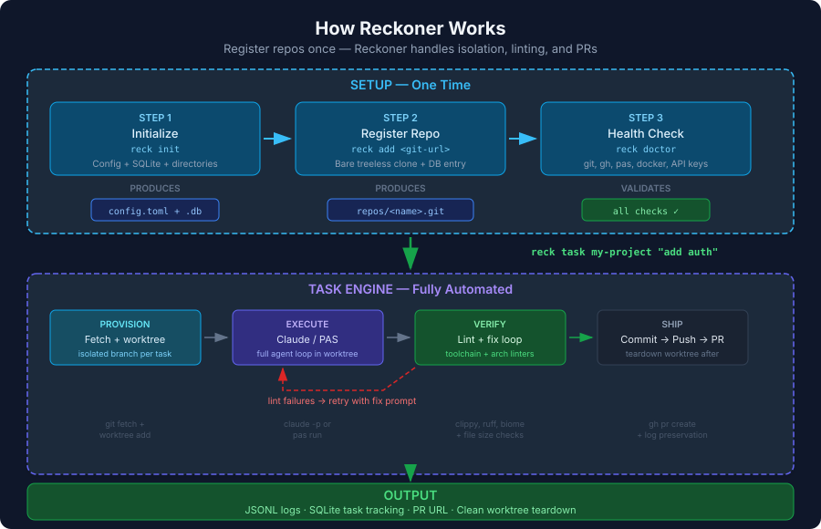
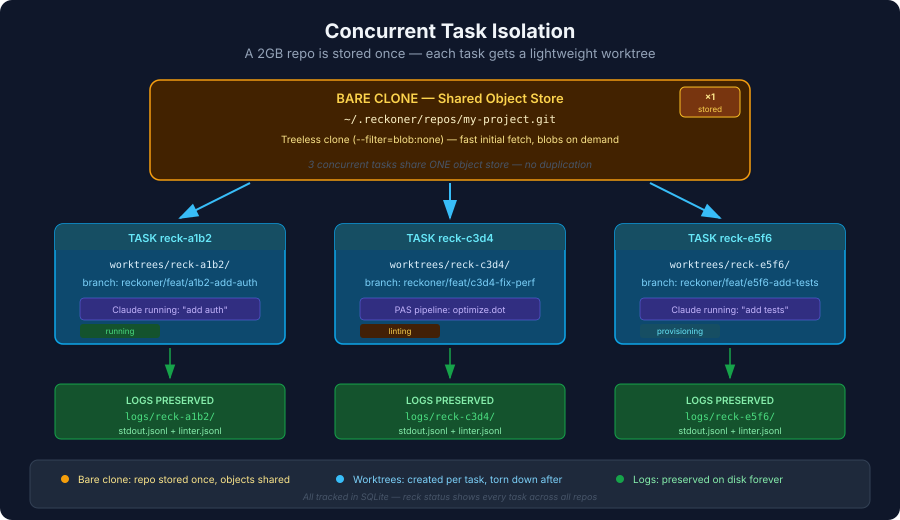

# Reckoner

**One command. Intent to pull request.**

Reckoner is an AI software factory for your terminal. Point it at any git repo, describe what you want — as a prompt, a spec file, or a Beads epic — and walk away. It fetches the latest code, spins up an isolated worktree, runs a [PAS](https://github.com/citadelgrad/pascals-discrete-attractor) pipeline, auto-fixes lint violations, and opens a GitHub PR — all without touching your working directory.

```sh
reck task my-project --prompt "add user authentication with JWT tokens"
# → fetches latest code
# → creates isolated worktree on a fresh branch
# → runs PAS pipeline against the worktree
# → formats, lints, and typechecks the result
# → auto-fixes any violations (up to 3 iterations)
# → commits, pushes, opens a PR
# → checks out the branch in your working clone
# → tears down the worktree, preserves all logs
# → PR: https://github.com/user/my-project/pull/42
```

**Name origin:** Pascal's mechanical calculator was called "the Reckoner." Reckoner is the machine; [PAS](https://github.com/citadelgrad/pascals-discrete-attractor) is the engine inside it.

## Why Reckoner

### Your repo is stored once, not copied per task

Most AI coding tools check out the full repository for every task. Reckoner stores each repo as a single bare clone and creates lightweight git worktrees — branches that share the same object store. A 2GB repo stays 2GB whether you run 1 task or 20 concurrently. Worktrees are torn down after completion; logs are preserved forever.





### AI writes the code. Reckoner makes sure it's clean.

After PAS generates changes, Reckoner runs your full toolchain — formatter, linter, typechecker — automatically detected per language. When violations are found, it doesn't just report them. It generates a structured remediation prompt and sends the agent back in to fix them. This lint-fix loop runs up to N iterations, with stuck-violation detection that stops early if the same issue persists across rounds instead of looping forever.

Supported toolchains out of the box:

| Language | Format | Lint | Typecheck |
|----------|--------|------|-----------|
| Rust | `cargo fmt` | `cargo clippy` | `cargo check` |
| Python | `ruff format` | `ruff check` | `ty check` |
| TypeScript/JS | `biome format` | `biome check` | — |

Override any of these per-repo with a `.reckoner/toolchain.toml` file.

### Drop-in custom linters

Place any executable in `.reckoner/linters/` (per-repo) or `~/.reckoner/linters/` (global). It receives the worktree path as an argument and outputs JSONL `LintFinding` records. Reckoner discovers and runs it automatically — no configuration, no plugin API. Enforce import boundaries, naming conventions, file organization, or anything else your team cares about.

### Scheduled pipelines that run while you sleep

Set up recurring tasks with a single command. Reckoner generates native macOS launchd agents so your pipelines fire on schedule without a server, a daemon, or Docker running in the background.

```sh
reck schedule add --name nightly-cleanup \
  --repo my-project --pipeline entropy-gc.dot --cron "0 3 * * *"
```

### Every task is auditable

All output is structured JSONL — PAS responses, toolchain results, lint findings, fix-loop iterations. Each task gets its own log directory that survives worktree teardown. Query logs locally with [`hl`](https://github.com/pamburus/hl) (auto-detected), or spin up the built-in Grafana + Loki stack with one command:

```sh
reck infra up     # Loki + Grafana, ready in seconds
reck observe      # opens the dashboard
```

### Local branch handoff

When a working clone is registered for a repo, Reckoner automatically checks out the PR branch in your local clone after opening the PR — so you can inspect, iterate, or take over without re-pulling from GitHub.

```sh
reck repo set-working-dir my-project ~/projects/my-project
# Now every completed task lands on the right branch locally.
```

### Foundry integration

Reckoner fires a post-PR quality sweep via [Foundry](https://github.com/citadelgrad/foundry) with zero configuration. After opening a PR, it runs `foundry run post-feature` if the `foundry` binary is on PATH. Opt in by defining the profile in your repo's `foundry.yaml`; opt out by not defining it. Reckoner never fails if Foundry isn't installed.

## Quick Start

```sh
cargo install --path crates/reckoner-cli

reck init                                              # Create ~/.reckoner/ dirs + config + db
reck add git@github.com:user/my-project.git \          # Register a repo (bare treeless clone)
  --working-dir ~/projects/my-project                   # Optional: set working clone for branch handoff
reck task my-project --prompt "add user auth"          # Intent → PR, fully automated (pipeline auto-derived)
reck status                                            # Show active tasks
reck logs <task-id>                                    # View preserved logs
```

## Commands

### Repo management

| Command | What it does |
|---------|-------------|
| `reck init` | Create `~/.reckoner/` directories, default config, and SQLite database |
| `reck add <git-url>` | Register a repo (bare treeless clone, auto-detects default branch) |
| `reck add <git-url> --working-dir <path>` | Register and set local working clone in one step |
| `reck list` | List all registered repos |
| `reck remove <name>` | Unregister a repo and remove its bare clone |
| `reck sync <name>` | Fetch latest changes from origin |
| `reck repo set-working-dir <name> <path>` | Update the local working clone path for post-PR branch checkout |

### Running tasks

`reck task` accepts one **Intent source** (mutually exclusive). `--pipeline` is optional — if omitted, Reckoner calls `pas` to auto-derive a `.dot` pipeline from your intent:

| Intent source | Auto-derivation |
|---------------|----------------|
| `--prompt <text>` | `pas plan --spec --from-prompt "<text>"` → `pas generate <spec>` |
| `--spec <file>` | `pas generate <spec>` (add `--prd <file>` for PRD context) |
| `--epic <id>` | `pas scaffold <epic-id>` |

| Flag | What it does |
|------|-------------|
| `--prompt <text>` | Free-form prompt describing the work |
| `--spec <file>` | Path to a spec markdown file |
| `--spec <file> --prd <file>` | Spec paired with a PRD for additional business context |
| `--epic <id>` | Beads epic ID (e.g. `beads-abc`) |
| `--pipeline <file.dot>` | Override auto-derivation with a pre-built `.dot` pipeline |
| `--no-pr` | Run without creating a PR (useful for analysis tasks) |
| `--keep-worktree` | Preserve the worktree after completion |

**Examples:**

```sh
# One-off prompt — pipeline auto-derived via pas plan + pas generate
reck task my-project --prompt "fix the login timeout bug"

# From a spec file — pipeline auto-derived via pas generate
reck task my-project --spec docs/auth-spec.md

# From a spec + PRD
reck task my-project --spec docs/auth-spec.md --prd docs/auth-prd.md

# From a Beads epic — pipeline auto-derived via pas scaffold
reck task my-project --epic beads-abc

# Skip PR creation
reck task my-project --prompt "audit the codebase for N+1 queries" --no-pr

# Use a pre-built pipeline (escape hatch)
reck task my-project --prompt "fix login bug" --pipeline pipelines/bugfix.dot
```

### Observability and logs

| Command | What it does |
|---------|-------------|
| `reck status` | All active tasks in a table |
| `reck status <task-id>` | Detailed view: branch, PR URL, cost, errors |
| `reck logs <task-id>` | Summary of all log files for a task |
| `reck logs <task-id> --app` | View PAS stdout output |
| `reck logs <task-id> --lint` | View lint findings |
| `reck logs <task-id> --filter <str>` | Filter log lines by keyword |
| `reck lint <repo>` | Standalone toolchain + architectural lint run |
| `reck doctor` | Health checks: git, gh, pas, Docker, database |
| `reck config` | Show current configuration |

### Scheduling and infrastructure

| Command | What it does |
|---------|-------------|
| `reck schedule add/list/remove/run` | Manage background pipelines (macOS launchd) |
| `reck infra up/down/status` | Manage observability stack (Loki + Grafana) |
| `reck observe` | Open Grafana dashboard in browser |

All commands support `reck --verbose <command>` for debug-level tracing output.

## How It Works

A `reck task` moves through a state machine with full audit trail:

```
pending → provisioning → running → linting → pr_open → done
                                      ↓
                                   (fix loop: up to N iterations)
                                      ↓
                                    failed (if unrecoverable)
```

Every state transition is recorded in the database with a timestamp and detail message, so you can reconstruct exactly what happened and when.

**Branch naming:** `reckoner/feat/reck-<id>-<intent-slug>` — the intent label is slugified and truncated. Task IDs look like `reck-a3f7c1d2`.

**PR body:** Auto-generated with a summary, a diffstat of changes, the task ID, and a note that human review is required.

**Post-PR steps (in order):**
1. If `working_dir` is set: `git fetch` + `git checkout <branch>` in your local clone
2. If `foundry` is on PATH: `foundry run post-feature` (errors swallowed — opt-in via `foundry.yaml`)

## Architecture

Three layers, clean separation:

| Layer | Tool | Role |
|-------|------|------|
| **Engine** | [PAS](https://github.com/citadelgrad/pascals-discrete-attractor) | DOT-based pipeline runner — generates and executes AI workflows |
| **Factory** | Reckoner (`reck`) | Environment setup: bare clones, worktrees, lint loop, PR, branch handoff |
| **Platform** | [Foundry](https://github.com/citadelgrad/foundry) | Post-build quality gates: security, docs, custom checks |

Two Rust crates inside Reckoner:

| Crate | Role |
|-------|------|
| **reckoner-core** | All business logic: config, SQLite, repo management, task orchestration, lint-fix loop, toolchain detection, scheduling, observability |
| **reckoner-cli** | Thin clap CLI binary (`reck`) — parses args, delegates to core |

### Design decisions

| Decision | Why |
|----------|-----|
| **rusqlite** (sync) over sqlx | Matches SQLite's synchronous reality. Faster CLI startup, no async runtime needed for DB ops |
| **Shell out to `git`/`gh`** | Auth is free (SSH keys, credential managers). No C dependencies from git2/gitoxide |
| **Bare clones + worktrees** | Shared object store. A 2GB repo stored once serves unlimited concurrent tasks |
| **JSONL logs on disk** | Zero infrastructure. Queryable with `hl`, `jq`, or the built-in Grafana stack |
| **PAS for all execution** | Single execution path — no direct Claude invocation. All Intent auto-derives a `.dot` pipeline via `pas plan`/`generate`/`scaffold` before anything runs. Pass `--pipeline` to bypass derivation |
| **Convention-based Foundry hook** | Zero coupling — Reckoner shells out to `foundry` if present. Opt-in by defining the profile; no shared config |
| **bollard for Docker API** | Pure Rust Docker client for container-based execution (security-hardened: `CAP_DROP ALL`, no-new-privileges, memory/CPU/PID limits) |

## State

Everything lives under `~/.reckoner/`:

```
~/.reckoner/
├── config.toml              # User configuration
├── reckoner.db              # SQLite (WAL mode, 0600 permissions)
├── repos/
│   └── <name>.git           # Bare clones (shared object store)
├── worktrees/               # Transient, per-task (cleaned up automatically)
├── logs/
│   └── <task-id>/           # Permanent — survives worktree teardown
│       ├── stdout.jsonl     # PAS output
│       ├── stderr.log       # Error output
│       ├── toolchain.jsonl  # Format/lint/typecheck results
│       ├── linter.jsonl     # Architectural lint findings
│       └── fix-loop-summary.jsonl
└── infra/
    └── docker-compose.yml   # Grafana + Loki stack
```

## Configuration

Config lives at `~/.reckoner/config.toml`. Run `reck init` to create defaults.

```toml
[general]
repos_dir = "~/.reckoner/repos"
worktrees_dir = "~/.reckoner/worktrees"
logs_dir = "~/.reckoner/logs"

[pas]
binary = "pas"
default_model = "sonnet"
default_max_budget_usd = 10.0

[git]
auto_pr = true
pr_prefix = "reckoner"

[linters]
enabled = true
max_fix_iterations = 3
max_file_lines = 500
```

## Prerequisites

- [PAS](https://github.com/citadelgrad/pascals-discrete-attractor) (`pas` on PATH) — the execution engine; requires its own Claude/API setup
- Git, GitHub CLI (`gh`)
- [OrbStack](https://orbstack.dev/), [Colima](https://github.com/abiosoft/colima), or Docker — for container-based linting and the observability stack
- [Foundry](https://github.com/citadelgrad/foundry) (`foundry` on PATH) — optional, for post-PR quality gates

## License

Licensed under either of [Apache License, Version 2.0](LICENSE-APACHE) or [MIT License](LICENSE-MIT) at your option.
